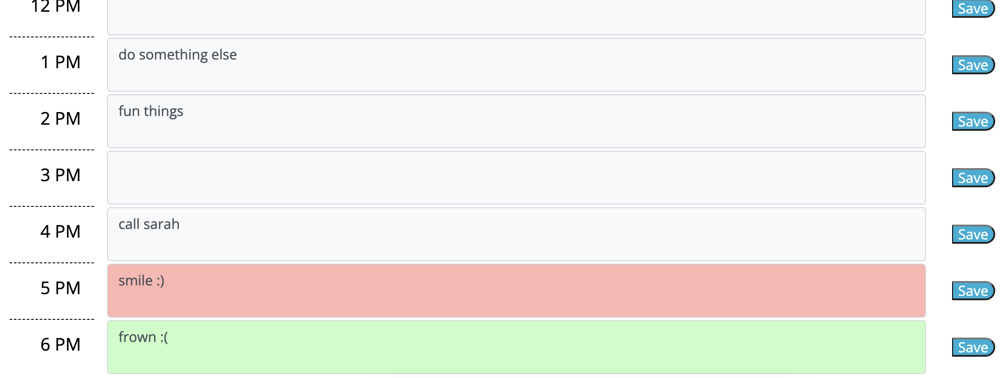

# module-5-scheduler
## Purpose
This project required using primarily HTML and Javascript in conjunction with the third-party API's Bootstrap and jQuery to create a webpage that presents today's date above a grid showing the working hours of the day. The completed project allows a user to enter events in any provided hour block, save the event, and have it remain on the schedule upon leaving and returning to the page. Essentially, this creates a simple day planner, with color-coding to indicate past hours, the present hour and the hours yet to come.

## Coding Process and Obstacles
I started out by inserting a dayjs component to return the current date to the page header. Then I made a grid for the scheduler using Bootstrap classes and its 12-column spacing format. Most of the CSS had been provided in a stylesheet, but I added two classes for light-green and light-red backgrounds against which the user text would display more legibly than against the "bg-success" and "bg-danger" classes in Bootstrap.

Next, I used Javascript with the jQuery library to connect the "save" button on each row to a function that would send the textarea's content to an array, along with the row to which it belongs (using event target). I then added a code block to the top of the script that would retrieve the saved values and populate the corresponding textarea with any previously saved values from local storage.

Finally, I used dayjs in the script file to color-code the scheduler, with time blocks that have already passed displaying in a light gray background, the current time block in light red, and future blocks in light green.

## Credits
This project came almost entirely from my own faculties, although I would find myself frequently consulting resources like W3Schools and MDN Web Docs for syntax reference. I found that with jQuery I could efficiently repurpose what I learned in a Coding Quiz project (specifically regarding storing, retrieving and parsing arrays of objects) to make this webpage work correctly.

Here is a screenshot:

I hope you appreciate this Coding Quiz, you can quiz yourself at the [deployed GitHub webpage.](https://briancampbell003.github.io/module-5-scheduler)